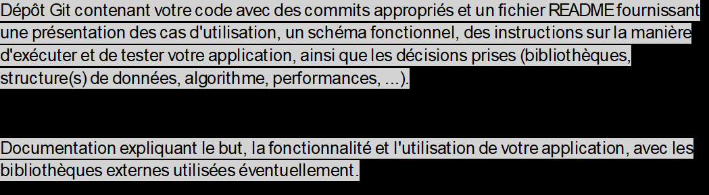

## Organisation 

Concernant l'ordonnancement au sein du collectif, nous avons établi une méthodologie structurée, se déclinant comme suit :

* Nous avons instauré un référentiel GIT.
* Nous avons mené des concertations en vue de dégager une idée centrale pour notre projet.
* Face aux divers projets et examens qui exigeaient notre attention, nous avons entrepris un POC (Proof of Concept) dans le but de
démarrer promptement et de bâtir des fondations robustes.
*En ce qui concerne la répartition des responsabilités au sein du groupe :
  * Lydia s'est consacrée à la génération des fichiers CSV, ainsi qu'à la rédaction de la documentation et du fichier README.
  * Rayan a pris en charge le développement des deux fonctions de parsage des fichiers CSV.
  * Sélim, quant à lui, a dirigé la conception de l'algorithme d'affectation des événements aux hôpitaux, en
  tenant compte de certaines contraintes.
  * Timothée est responsable de la mise en œuvre des tests exploitant les fonctionnalités de ZIOStream, permettant
  de générer des événements.

## Objective



## Présentation des cas d'utilisation

## Schéma fonctionnel 
Build an application that retrieves, processes, and analyzes data from a chosen source using ZIO Streams. The source of data can be a public API, local files, or any relevant data that aligns with the chosen theme.

## Instruction
Sur la manière d'éxecuter et de tester votre app 

## Décisions importantes prises
bibl, sdd, algo, perf

## Documentation

but, fonctionnalité, utilisation de l'appli (avec bibli externes en opt)

L'objectif de notre application est de réduire les appels qui sont lancés au samu tous les jours.
L'application aurait pour objectif de présenter une interface aux utilisateurs où ces derniers
pourraient remplir un formulaire et trouver l'hopital le plus proche de leur position.


## EXEMPLE 

## Requirements

1. Functional Programming Concepts Integration:
    * Demonstrate immutability by designing data structures and operations that emphasize immutable values.
    * Utilize case classes to model data entities, capturing relevant attributes and functionalities.
    * Create new types to encapsulate domain-specific logic and enforce type safety.
    * Implement pattern matching to handle different cases and efficiently process data.
    * Utilize recursion where appropriate to perform operations or traverse data structures.
1. ZIO Streams Implementation:
    * Utilize ZIO Streams for handling data processing and manipulation.
    * Implement stream transformations, such as mapping, filtering, and aggregating, to showcase ZIO Streams' capabilities.
    * Demonstrate error handling and resource management using ZIO's effectful streaming.
    * Use other libraries from the ZIO ecosystem if relevant, such as `zio-jdbc`,`zio-json`, or `zio-http` to handle database operations, JSON parsing, and HTTP application, respectively.
1. Source Data Selection:
    * Choose a relevant source for the data to be processed. Options include:
        * Public APIs providing real-time or static data (e.g., weather data, financial data, etc.).
        * Local files containing diverse and substantial data.
        * Any other data sources relevant to the theme (ensure it allows for ample demonstration of functional programming concepts).
1. Application Functionality:
    * Design and implement functionality to process and analyze the retrieved data.
    * Showcase the application's capability to perform meaningful operations (e.g., filtering, aggregation, transformation, etc.).
    * Generate informative output or visualization based on processed data.
    * Write test cases to validate the functionality of your application.
    * Be creative and explain your motivation in your project README file.
1. Code Quality and Documentation:
    * Write clean, well-documented code that reflects best practices of functional programming.
    * Include comments where necessary to explain complex logic or important design decisions.
    * Ensure readability, maintainability, and adherence to functional programming principles
1. Git repository and documentation quality:
    * Set up a Git repository to manage your application's source code
    * Ensure that your repository is well-organized, contains appropriate commits, and has a clear README file.
    * Document your code, including class and method-level comments, explaining the purpose and functionality of each component.

## Additional Requirements

1. Group Size: Form groups of up to 4 students. You are encouraged to collaborate and discuss ideas within your group but ensure that each member actively contributes to the project.

1. Due Date: The project is expected to be completed and submitted by **Friday evening, January 12, 2024**. Late submissions may incur penalties unless prior arrangements have been made with the instructor.

1. Language: Use English for code, comments and documentation.

1. Plagiarism or using code from external sources without proper attribution is strictly prohibited.

1. Feel free to consult course materials, documentation, or relevant resources while working on the exam.


**Take your time discovering the ZIO ecosystem by reading the official documentation.**


---

## Annex: ZIO Application Example

The complete code below provides a complete Scala project and ZIO application. When building your application, you can reuse some of the components. Please review Scala and other dependencies version number to be up to date.

### Data Model

First, we are defining a `case class` to represents games. Your solution should include scores, predictions, ... In this example, we are using opaque types, but this is optional.

```scala
final case class Game(
    date: GameDate,
    season: SeasonYear,
    playoffRound: Option[PlayoffRound],
    homeTeam: HomeTeam,
    awayTeam: AwayTeam
)
```

